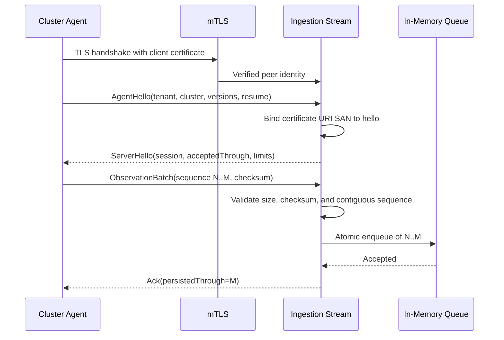
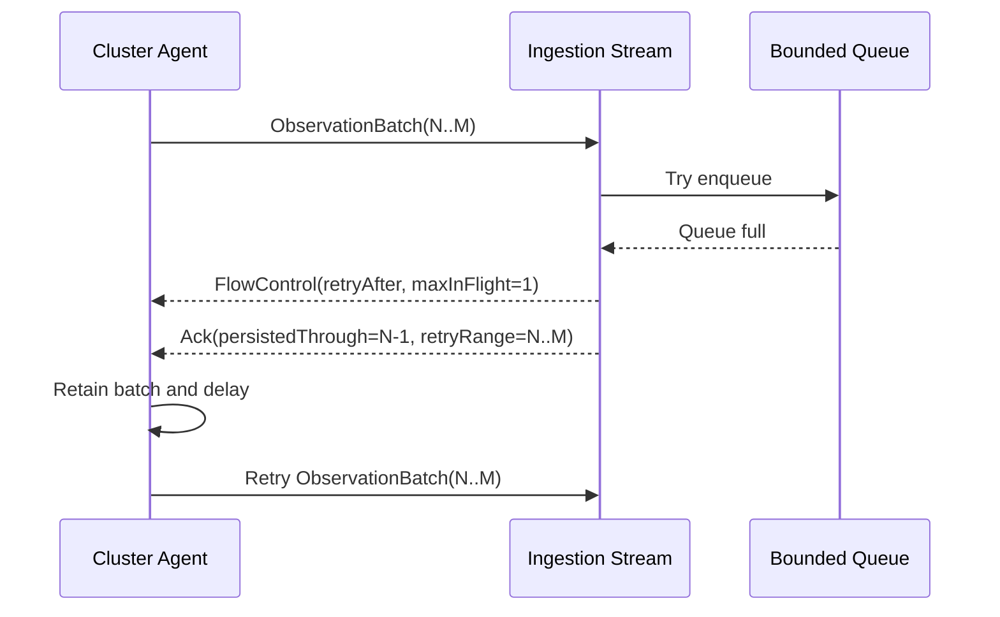
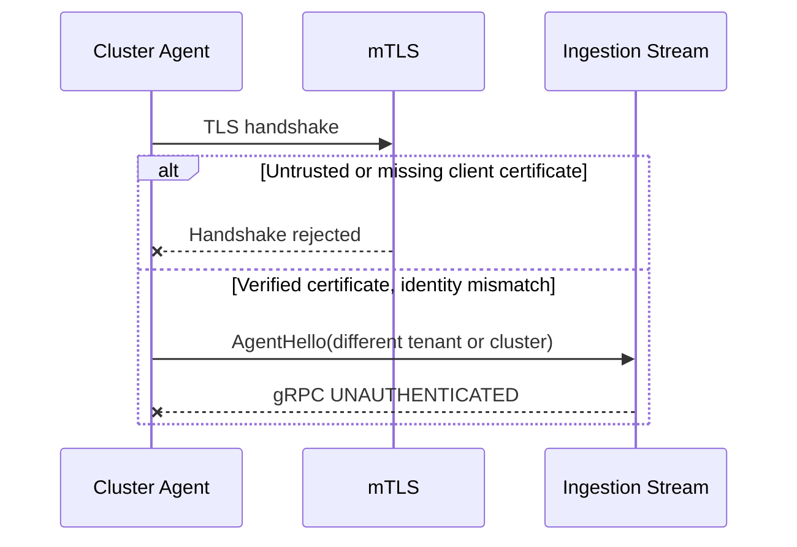

# Ingestion Service

## Scope

The ingestion service terminates the `cost.v1.agent.AgentIngestionService.Connect`
bidirectional stream, authenticates cluster agents, validates and sequences
observation batches, and places accepted batches into a bounded in-memory queue.
ClickHouse persistence and queue consumers are intentionally excluded from this
version.

## Runtime boundaries

- The gRPC listener defaults to `:8080`.
- The plaintext HTTP health listener defaults to `:8081`.
- Production transport requires TLS 1.2 or newer and a verified client
  certificate.
- `INGESTION_INSECURE=true` is a local-development-only override.
- A single active stream is allowed for each tenant and cluster pair.
- Queue capacity and high watermark are fixed process configuration.

## Agent identity

Each client certificate MUST contain a URI SAN with this form:

```text
spiffe://kube-cost/tenant/{tenant_id}/cluster/{cluster_id}
```

The URI tenant and cluster MUST exactly match `AgentHello`. The TLS layer
validates the client certificate against the configured client CA before the
application performs this binding. The server certificate, private key, and
client CA are mounted from the `ingestion.tlsSecretName` Kubernetes Secret.
The agent mounts its client certificate, private key, and server CA from
`agent.tlsSecretName`.

## Queue and acknowledgement semantics

An incoming batch is validated for record count, encoded size, contiguous
sequence numbers, payload presence, event IDs, and deterministic SHA-256
checksum. Enqueue is atomic for all newly accepted observations in the batch.

For this in-memory phase, `persisted_through_sequence` means persisted to the
process-local queue. It does not mean durable storage. A process restart loses
the queue and sequence watermarks, including data already acknowledged to an
agent. This phase is therefore not crash durable. The later durable queue or
ClickHouse writer MUST move the acknowledgement boundary before this service
can claim restart durability.

- A batch beginning at the next expected sequence is queued and acknowledged.
- A fully duplicated batch is acknowledged without another enqueue.
- An overlapping retry queues only the suffix after the current watermark.
- A gap returns the missing `retry_ranges` and does not enqueue the batch.
- An invalid batch receives terminal record rejection and does not advance the
  watermark.
- A full queue returns flow control followed by a retry acknowledgement.

## Normal delivery



## Reconnect and retry

```mermaid
sequenceDiagram
    participant A as Cluster Agent
    participant I as Ingestion Stream
    participant Q as In-Memory Queue

    A->>I: Reconnect and AgentHello(resumeAfter=M)
    I-->>A: ServerHello(acceptedThrough=M)
    A->>I: Retry batch M..P
    I->>I: Drop duplicate M; select suffix M+1..P
    I->>Q: Enqueue suffix M+1..P
    Q-->>I: Accepted
    I-->>A: Ack(persistedThrough=P)
```

## Backpressure



## Authentication failure



## Configuration

| Environment variable | Default |
|---|---|
| `GRPC_ADDRESS` | `:8080` |
| `HEALTH_ADDRESS` | `:8081` |
| `INGESTION_INSECURE` | `false` |
| `INGESTION_TLS_CERT_FILE` | `/etc/kube-cost/tls/tls.crt` |
| `INGESTION_TLS_KEY_FILE` | `/etc/kube-cost/tls/tls.key` |
| `INGESTION_CLIENT_CA_FILE` | `/etc/kube-cost/tls/ca.crt` |
| `INGESTION_QUEUE_CAPACITY` | `1000` batches |
| `INGESTION_QUEUE_HIGH_WATERMARK_PERCENT` | `80` |
| `INGESTION_MAX_BATCH_RECORDS` | `500` |
| `INGESTION_MAX_BATCH_BYTES` | `4194304` |
| `INGESTION_BACKPRESSURE_DELAY` | `1s` |
| `INGESTION_HEARTBEAT_INTERVAL` | `30s` |

## Follow-on work

The queue consumer will add durable raw-envelope storage and ClickHouse writes.
At that point, sequence state must move to durable storage and acknowledgements
must advance only after the selected durability boundary succeeds.
