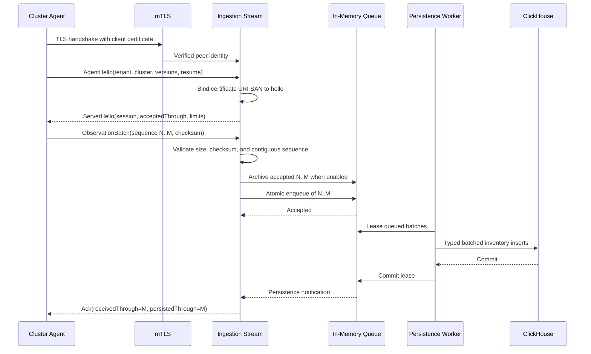
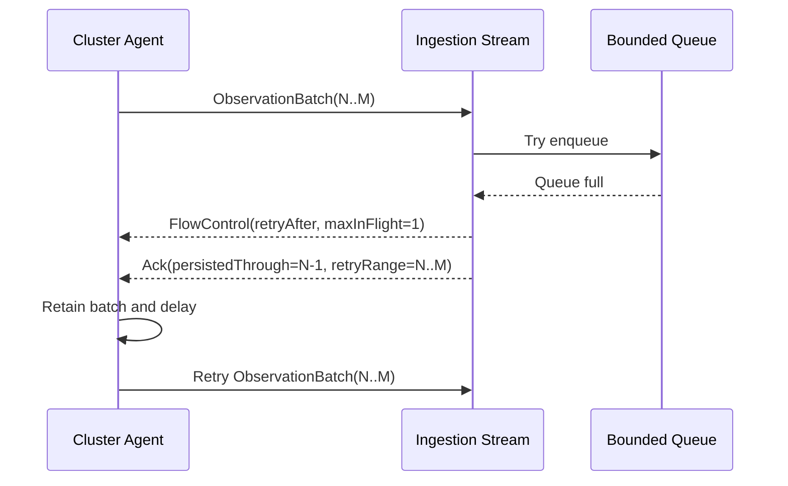
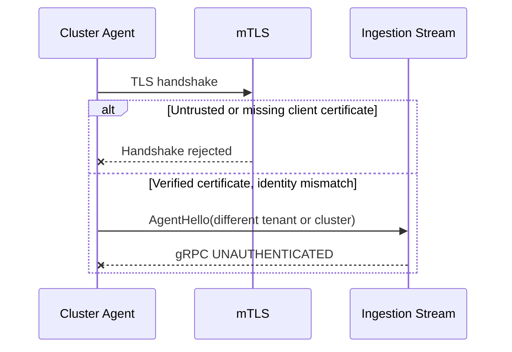

# Ingestion Service

## Scope

The ingestion service terminates the `cost.v1.agent.AgentIngestionService.Connect`
bidirectional stream, authenticates cluster agents, validates and sequences
observation batches, places accepted batches into a bounded in-memory queue,
optionally archives raw accepted batches, and persists inventory events into
ClickHouse.

## Runtime boundaries

- The gRPC listener defaults to `:8080`.
- The plaintext HTTP health listener defaults to `:8081`.
- Production transport requires TLS 1.2 or newer and a verified client
  certificate.
- `INGESTION_INSECURE=true` is a local-development-only override.
- A single active stream is allowed for each tenant and cluster pair.
- Queue capacity and high watermark are fixed process configuration.
- Readiness requires a successful ClickHouse connection.
- Raw accepted batch archive is enabled when `INGESTION_RAW_ARCHIVE_DIR` is set.
- External sequence checkpoints are enabled when
  `INGESTION_SEQUENCE_CHECKPOINT_DIR` is set.
- A persistence worker leases queued batches and returns failed leases to the
  queue with bounded exponential backoff.

## Agent identity

Each client certificate MUST contain a URI SAN with this form:

```text
spiffe://kube-cost/tenant/{tenant_id}/cluster/{cluster_id}
```

The URI tenant and cluster MUST exactly match `AgentHello`. The TLS layer
validates the client certificate against the configured client CA before the
application performs this binding. The server certificate, private key, and
client CA are mounted from the `ingestion.tlsSecretName` Kubernetes Secret.
The agent mounts its client certificate, private key, and server CA from
`agent.tlsSecretName`.

## Queue and acknowledgement semantics

An incoming batch is validated for record count, encoded size, contiguous
sequence numbers, payload presence, event IDs, and deterministic SHA-256
checksum. Enqueue is atomic for all newly accepted observations in the batch.

`received_through_sequence` means the stream accepted the batch. The server
does not advance `persisted_through_sequence` until the accepted suffix is
archived when raw archive is enabled, the persistence worker commits the queue
lease after a successful ClickHouse write, and the external sequence checkpoint
is saved when configured. Without `INGESTION_SEQUENCE_CHECKPOINT_DIR`, the
watermark remains process-local.

- A batch beginning at the next expected sequence is queued, written, and then
  acknowledged as persisted.
- A fully duplicated batch is acknowledged without another enqueue.
- An overlapping retry queues only the suffix after the current watermark.
- A gap returns the missing `retry_ranges` and does not enqueue the batch.
- An invalid batch receives terminal record rejection and does not advance the
  watermark.
- A full queue returns flow control followed by a retry acknowledgement.

## Normal delivery



## Reconnect and retry

```mermaid
sequenceDiagram
    participant A as Cluster Agent
    participant I as Ingestion Stream
    participant Q as In-Memory Queue

    A->>I: Reconnect and AgentHello(resumeAfter=M)
    I-->>A: ServerHello(acceptedThrough=M)
    A->>I: Retry batch M..P
    I->>I: Drop duplicate M; select suffix M+1..P
    I->>Q: Enqueue suffix M+1..P
    Q-->>I: Accepted
    I-->>A: Ack(receivedThrough=P, persistedThrough=P after commit)
```

## Backpressure



## Authentication failure



## Configuration

| Environment variable | Default |
|---|---|
| `GRPC_ADDRESS` | `:8080` |
| `HEALTH_ADDRESS` | `:8081` |
| `INGESTION_INSECURE` | `false` |
| `INGESTION_TLS_CERT_FILE` | `/etc/kube-cost/tls/tls.crt` |
| `INGESTION_TLS_KEY_FILE` | `/etc/kube-cost/tls/tls.key` |
| `INGESTION_CLIENT_CA_FILE` | `/etc/kube-cost/tls/ca.crt` |
| `INGESTION_QUEUE_CAPACITY` | `1000` batches |
| `INGESTION_QUEUE_HIGH_WATERMARK_PERCENT` | `80` |
| `INGESTION_MAX_BATCH_RECORDS` | `500` |
| `INGESTION_MAX_BATCH_BYTES` | `4194304` |
| `INGESTION_BACKPRESSURE_DELAY` | `1s` |
| `INGESTION_HEARTBEAT_INTERVAL` | `30s` |
| `CLICKHOUSE_ADDRESS` | `clickhouse:9000` |
| `CLICKHOUSE_DATABASE` | `kube_cost` |
| `CLICKHOUSE_USERNAME` | `kube_cost` |
| `CLICKHOUSE_PASSWORD` | `kube_cost` |
| `CLICKHOUSE_SECURE` | `false` |
| `INGESTION_PERSISTENCE_BATCH_SIZE` | `20` queued batches |
| `INGESTION_PERSISTENCE_RETRY_INITIAL` | `1s` |
| `INGESTION_PERSISTENCE_RETRY_MAXIMUM` | `30s` |
| `INGESTION_RAW_ARCHIVE_DIR` | unset |
| `INGESTION_SEQUENCE_CHECKPOINT_DIR` | unset |

When raw archive is enabled, deterministic `ObservationBatch` protobuf files are
written under:

```text
<root>/<tenant_id>/<cluster_id>/<yyyy>/<mm>/<dd>/<first>-<last>-<batch_id>.pb
```

Path components are sanitized. The filesystem backend is the local-compatible
first implementation; production deployments should map the same abstraction to
object storage.

When sequence checkpoints are enabled, per-tenant/cluster JSON checkpoint files
are written under:

```text
<root>/<tenant_id>/<cluster_id>/checkpoint.json
```

The checkpoint stores the cumulative `persisted_through_sequence` used in
`ServerHello` after process restart.

## Replay inspection

`go run ./tools/replay -archive-dir <root>` scans archived `.pb` files, decodes
`ObservationBatch` payloads, and emits JSON Lines with path, batch ID, sequence
range, and observation count. This is the first replay-planning tool; future
work should add filtered re-publication into a durable stream or ingestion
endpoint.

## Follow-on work

Metrics persistence, object-storage raw archive, and durable stream remain
follow-on work. The current implementation waits for raw filesystem archive when
enabled, the ClickHouse persistence worker, and external sequence checkpoint
save when configured before advancing `persisted_through_sequence`.
